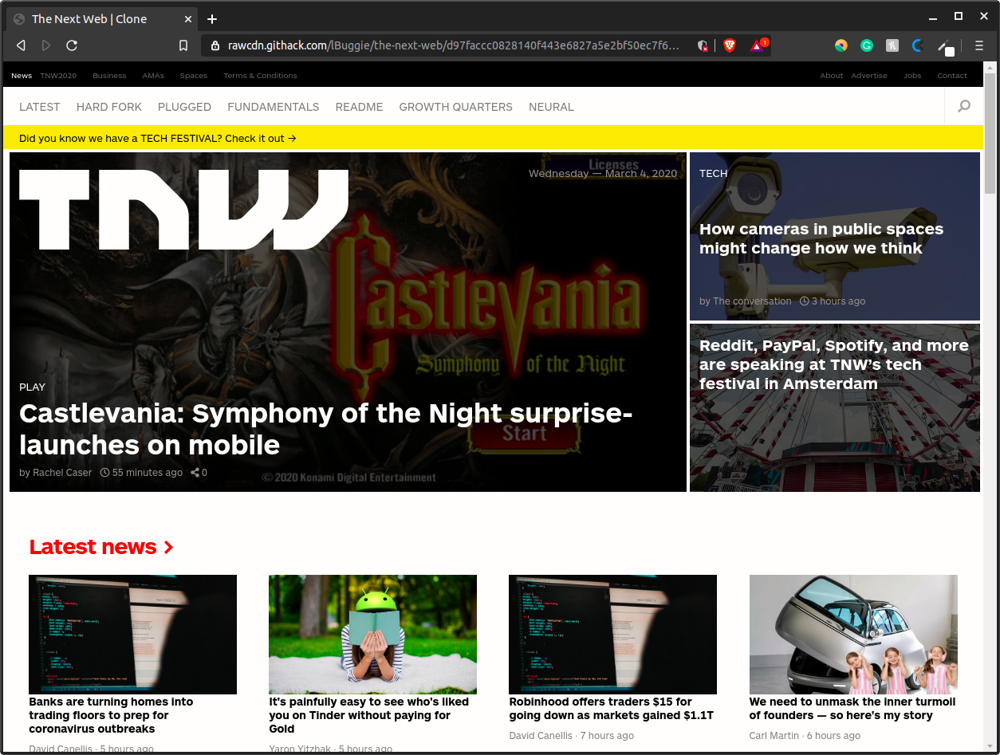

# The Next Web Responsive Clone

> This a clone of The Next Web website, where all the responsiveness capabilities have been included.

- Original: https://thenextweb.com/

## Built With

- HTML5, CSS3
- Flexbox, Grid, Float

## Live Demo

[Live Demo Link](https://rawcdn.githack.com/lBuggie/the-next-web/d97faccc0828140f443e6827a5e2bf50ec7f6cff/index.html)

## Authors

👤 **Isaac Gonzalez**

- Github: [@ghamtre](https://github.com/ghamtre)
- Twitter: [@idgm5](https://twitter.com/idgm5)
- Linkedin: [linkedin](https://www.linkedin.com/in/isaacmunguia/)

👤 **Sebastian Rodriguez**

- Github: [@sebGilR](https://github.com/sebGilR)
- Twitter: [@sebGilR](https://twitter.com/sebGilR)
- Linkedin: [sebastianGilRodriguez](https://www.linkedin.com/in/sebastianGilRodriguez)

## 🤝 Contributing

Contributions, issues and feature requests are welcome!

Feel free to check the [issues page](issues/).

## Show your support

Give a ⭐️ if you like this project!

